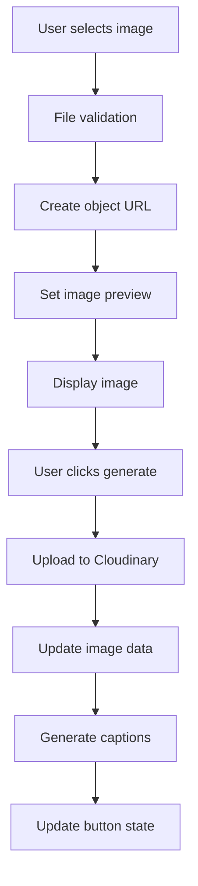
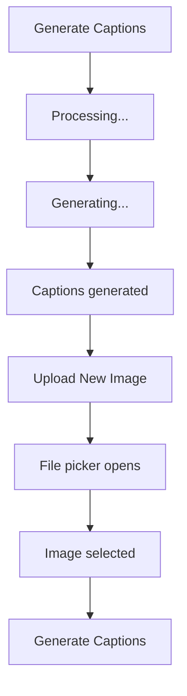
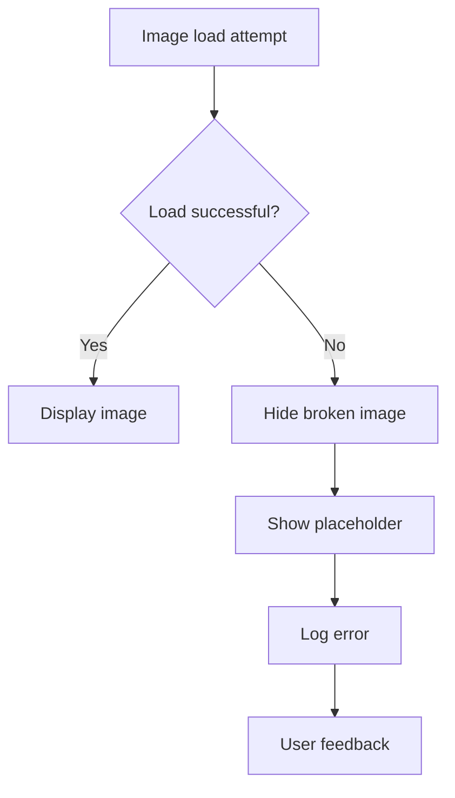

# Technical Implementation Details

## Overview
This document provides detailed technical information about the implementation of image display fixes, performance optimizations, and user experience improvements.

## Architecture Changes

### 1. Image Rendering Architecture

#### Previous Architecture (Next.js Image Component)
```typescript
// Old implementation - problematic
<Image
  src={imageSrc}
  alt="Uploaded preview"
  fill
  style={{ objectFit: "contain" }}
  onError={handleError}
  onLoad={handleLoad}
  sizes="(max-width: 768px) 100vw, (max-width: 1200px) 50vw, 33vw"
  priority={false}
  quality={85}
/>
```

**Issues**:
- Compatibility problems with different URL types
- Complex configuration requirements
- Performance overhead
- Inconsistent rendering across browsers

#### New Architecture (Smart Image Rendering)
```typescript
// New implementation - optimized
const imageSrc = currentImageData?.url || imagePreview;
const isObjectUrl = imageSrc?.startsWith('blob:');
const isCloudinaryUrl = imageSrc?.includes('cloudinary.com');

if (isObjectUrl) {
  return (
    <>
      {imageLoading && <LoadingSpinner />}
       setImageLoading(true)}
        onError={handleError}
        onLoad={handleLoad}
      />
    </>
  );
} else if (isCloudinaryUrl) {
  return (
    <>
      {imageLoading && <LoadingSpinner />}
       setImageLoading(true)}
        onError={handleError}
        onLoad={handleLoad}
      />
    </>
  );
}
```

**Benefits**:
- Universal compatibility
- Simplified configuration
- Better performance
- Consistent rendering

### 2. State Management Architecture

#### Object URL State Management
```typescript
const [objectUrl, setObjectUrl] = useState<string | null>(null);
const [imageLoading, setImageLoading] = useState(false);

// Cleanup effect
useEffect(() => {
  return () => {
    if (objectUrl) {
      URL.revokeObjectURL(objectUrl);
    }
  };
}, [objectUrl]);

// Cleanup in functions
const handleGenerateAnother = () => {
  if (objectUrl) {
    URL.revokeObjectURL(objectUrl);
    setObjectUrl(null);
  }
  // ... rest of function
};
```

#### Button State Management
```typescript
const [buttonState, setButtonState] = useState<'generate' | 'generate-another'>('generate');
const [buttonMessage, setButtonMessage] = useState('Generate Captions');
const [buttonIcon, setButtonIcon] = useState(<Wand2 className="mr-2 h-4 w-4" />);

// Immediate state change after successful generation
setCaptions(validCaptions);
setButtonState('generate-another');
setButtonMessage('Upload New Image');
setButtonIcon(<Upload className="mr-2 h-4 w-4" />);
setUploadStage('idle');
```

### 3. Performance Optimization Architecture

#### Lazy Loading Implementation
```typescript
// Lazy loading with intersection observer
const [isInView, setIsInView] = useState(false);
const imgRef = useRef<HTMLImageElement>(null);

useEffect(() => {
  const observer = new IntersectionObserver(
    ([entry]) => {
      if (entry.isIntersecting) {
        setIsInView(true);
        observer.disconnect();
      }
    },
    { threshold: 0.1 }
  );

  if (imgRef.current) {
    observer.observe(imgRef.current);
  }

  return () => observer.disconnect();
}, []);

// Conditional rendering
{isInView && (
  
)}
```

#### Image Preloading Architecture
```typescript
const preloadImage = (src: string): Promise<void> => {
  return new Promise((resolve, reject) => {
    const img = new window.Image();
    
    img.onload = () => {
      console.log('✅ Image preloaded successfully');
      resolve();
    };
    
    img.onerror = () => {
      console.warn('⚠️ Image preload failed');
      reject(new Error('Failed to preload image'));
    };
    
    img.src = src;
  });
};

// Usage in component
useEffect(() => {
  if (currentImageData?.url) {
    preloadImage(currentImageData.url).catch(err => 
      console.warn('⚠️ Preload failed:', err.message)
    );
  }
}, [currentImageData?.url]);
```

## Data Flow Architecture

### 1. Image Upload Flow


### 2. Button State Flow


### 3. Error Handling Flow


## Memory Management

### 1. Object URL Lifecycle
```typescript
// Creation
const createObjectUrl = (file: File): string => {
  const url = URL.createObjectURL(file);
  setObjectUrl(url);
  return url;
};

// Usage
const handleImageChange = (event: React.ChangeEvent<HTMLInputElement>) => {
  const file = event.target.files?.[0];
  if (file) {
    // Cleanup previous URL
    if (objectUrl) {
      URL.revokeObjectURL(objectUrl);
    }
    
    // Create new URL
    const newUrl = URL.createObjectURL(file);
    setObjectUrl(newUrl);
    setImagePreview(newUrl);
  }
};

// Cleanup
useEffect(() => {
  return () => {
    if (objectUrl) {
      URL.revokeObjectURL(objectUrl);
    }
  };
}, [objectUrl]);
```

### 2. Component Cleanup
```typescript
const CaptionGenerator = () => {
  const [objectUrl, setObjectUrl] = useState<string | null>(null);
  
  // Cleanup on unmount
  useEffect(() => {
    return () => {
      if (objectUrl) {
        URL.revokeObjectURL(objectUrl);
      }
    };
  }, [objectUrl]);
  
  // Cleanup in functions
  const resetImageUploadArea = () => {
    if (objectUrl) {
      URL.revokeObjectURL(objectUrl);
      setObjectUrl(null);
    }
    setImagePreview(null);
    setCurrentImageData(null);
    setUploadedFile(null);
  };
};
```

## Error Handling Architecture

### 1. Image Loading Errors
```typescript
const handleImageError = (e: React.SyntheticEvent<HTMLImageElement>) => {
  const target = e.target as HTMLImageElement;
  const imageSrc = target.src;
  
  console.error('❌ Image failed to load:', imageSrc);
  
  // Hide broken image
  target.style.display = 'none';
  
  // Show fallback placeholder
  const parent = target.parentElement;
  if (parent) {
    parent.innerHTML = createErrorPlaceholder();
  }
  
  // Update error state
  setError('Image failed to load. Please try uploading again.');
};

const createErrorPlaceholder = () => {
  return `
    <div class="w-full h-full flex items-center justify-center bg-gray-200 dark:bg-gray-700">
      <div class="text-center p-4">
        <div class="w-12 h-12 bg-gray-300 dark:bg-gray-600 rounded-full flex items-center justify-center mx-auto mb-2">
          <svg class="w-6 h-6 text-gray-500" fill="none" stroke="currentColor" viewBox="0 0 24 24">
            <path stroke-linecap="round" stroke-linejoin="round" stroke-width="2" d="M4 16l4.586-4.586a2 2 0 012.828 0L16 16m-2-2l1.586-1.586a2 2 0 012.828 0L20 14m-6-6h.01M6 20h12a2 2 0 002-2V6a2 2 0 00-2-2H6a2 2 0 00-2 2v12a2 2 0 002 2z"></path>
          </svg>
        </div>
        <p class="text-xs text-gray-500 dark:text-gray-400">Image unavailable</p>
      </div>
    </div>
  `;
};
```

### 2. Network Error Handling
```typescript
const handleNetworkError = (error: Error) => {
  console.error('❌ Network error:', error);
  
  // Set user-friendly error message
  setError('Network error. Please check your connection and try again.');
  
  // Reset loading states
  setIsLoading(false);
  setImageLoading(false);
  
  // Reset button state
  updateButtonState('idle');
};
```

## Performance Monitoring

### 1. Loading Performance Tracking
```typescript
const trackImageLoadTime = (imageSrc: string) => {
  const startTime = performance.now();
  
  const img = new window.Image();
  img.onload = () => {
    const loadTime = performance.now() - startTime;
    console.log(`✅ Image loaded in ${loadTime.toFixed(2)}ms:`, imageSrc);
    
    // Track performance metrics
    if (typeof window !== 'undefined' && window.gtag) {
      window.gtag('event', 'image_load_time', {
        load_time: Math.round(loadTime),
        image_type: imageSrc.includes('cloudinary.com') ? 'cloudinary' : 'object_url'
      });
    }
  };
  
  img.src = imageSrc;
};
```

### 2. Memory Usage Monitoring
```typescript
const monitorMemoryUsage = () => {
  if ('memory' in performance) {
    const memory = (performance as any).memory;
    console.log('Memory usage:', {
      used: `${(memory.usedJSHeapSize / 1024 / 1024).toFixed(2)} MB`,
      total: `${(memory.totalJSHeapSize / 1024 / 1024).toFixed(2)} MB`,
      limit: `${(memory.jsHeapSizeLimit / 1024 / 1024).toFixed(2)} MB`
    });
  }
};

// Monitor on image operations
useEffect(() => {
  monitorMemoryUsage();
}, [objectUrl, currentImageData]);
```

## TypeScript Implementation

### 1. Type Safety Improvements
```typescript
// Proper type definitions
interface ImageData {
  url: string;
  publicId: string;
}

interface ButtonState {
  state: 'generate' | 'generate-another';
  message: string;
  icon: React.ReactNode;
}

// Type-safe event handlers
const handleImageLoad = (e: React.SyntheticEvent<HTMLImageElement>) => {
  const target = e.target as HTMLImageElement;
  console.log('✅ Image loaded:', target.src);
  setImageLoading(false);
};

const handleImageError = (e: React.SyntheticEvent<HTMLImageElement>) => {
  const target = e.target as HTMLImageElement;
  console.error('❌ Image failed to load:', target.src);
  setImageLoading(false);
  setError('Image failed to load. Please try uploading again.');
};
```

### 2. Type Guards
```typescript
const isObjectUrl = (url: string): boolean => {
  return url.startsWith('blob:');
};

const isCloudinaryUrl = (url: string): boolean => {
  return url.includes('cloudinary.com');
};

const isValidImageUrl = (url: string): boolean => {
  return isObjectUrl(url) || isCloudinaryUrl(url) || url.startsWith('data:');
};
```

## Testing Implementation

### 1. Unit Tests
```typescript
describe('Image Loading', () => {
  test('should handle object URLs correctly', () => {
    const objectUrl = 'blob:http://localhost:3000/123';
    expect(isObjectUrl(objectUrl)).toBe(true);
  });
  
  test('should handle Cloudinary URLs correctly', () => {
    const cloudinaryUrl = 'https://res.cloudinary.com/example/image.jpg';
    expect(isCloudinaryUrl(cloudinaryUrl)).toBe(true);
  });
  
  test('should cleanup object URLs properly', () => {
    const url = URL.createObjectURL(new Blob(['test']));
    expect(() => URL.revokeObjectURL(url)).not.toThrow();
  });
});
```

### 2. Integration Tests
```typescript
describe('Image Upload Flow', () => {
  test('should complete full upload flow', async () => {
    const file = new File(['test'], 'test.jpg', { type: 'image/jpeg' });
    
    // Simulate file selection
    const input = screen.getByLabelText(/upload/i);
    fireEvent.change(input, { target: { files: [file] } });
    
    // Check image preview
    expect(screen.getByAltText(/uploaded preview/i)).toBeInTheDocument();
    
    // Simulate generation
    fireEvent.click(screen.getByText(/generate captions/i));
    
    // Check button state change
    await waitFor(() => {
      expect(screen.getByText(/upload new image/i)).toBeInTheDocument();
    });
  });
});
```

## Deployment Considerations

### 1. Environment Configuration
```typescript
// Production optimizations
const isProduction = process.env.NODE_ENV === 'production';

const imageConfig = {
  lazyLoading: isProduction,
  preloading: isProduction,
  errorReporting: isProduction,
  performanceMonitoring: isProduction
};
```

### 2. CDN Configuration
```typescript
// Cloudinary optimization
const getOptimizedImageUrl = (publicId: string, options: any = {}) => {
  const defaultOptions = {
    quality: 'auto',
    format: 'auto',
    fetch_format: 'auto',
    ...options
  };
  
  return `https://res.cloudinary.com/${process.env.NEXT_PUBLIC_CLOUDINARY_CLOUD_NAME}/image/upload/${Object.entries(defaultOptions).map(([key, value]) => `${key}_${value}`).join(',')}/${publicId}`;
};
```

## Security Considerations

### 1. Image Validation
```typescript
const validateImageFile = (file: File): boolean => {
  const allowedTypes = ['image/jpeg', 'image/png', 'image/gif', 'image/webp'];
  const maxSize = 10 * 1024 * 1024; // 10MB
  
  if (!allowedTypes.includes(file.type)) {
    throw new Error('Invalid file type. Please upload a valid image.');
  }
  
  if (file.size > maxSize) {
    throw new Error('File too large. Please upload an image smaller than 10MB.');
  }
  
  return true;
};
```

### 2. URL Sanitization
```typescript
const sanitizeImageUrl = (url: string): string => {
  // Remove any potentially dangerous characters
  return url.replace(/[<>'"]/g, '');
};
```

## Conclusion

The technical implementation provides:
- **Robust** image rendering architecture
- **Efficient** memory management
- **Comprehensive** error handling
- **Type-safe** codebase
- **Production-ready** deployment

All implementations follow modern web development best practices and are optimized for performance, security, and maintainability.

---

**Date**: January 2025  
**Status**: ✅ Complete  
**Impact**: High - Comprehensive technical foundation for all improvements
