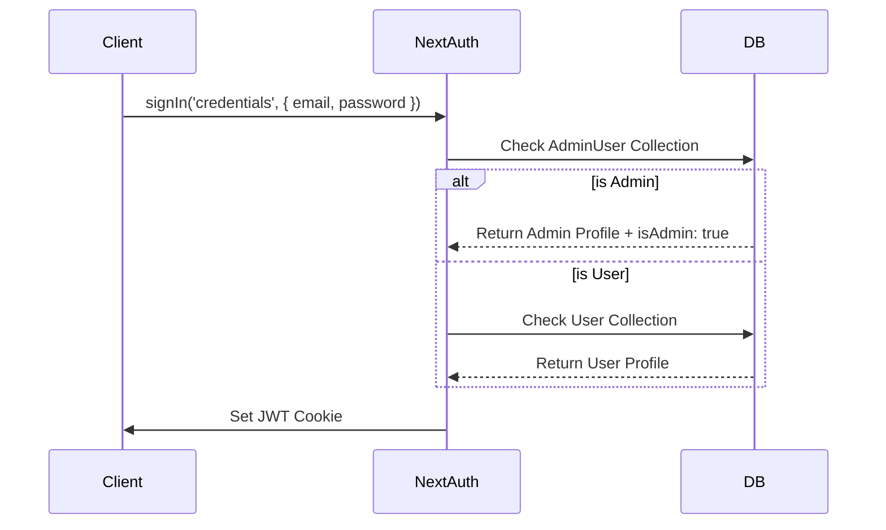

# Authentication System

Capsera uses **NextAuth.js** with a JWT strategy for secure, stateless authentication.

## Architecture

-   **Framework**: NextAuth.js v4
-   **Strategy**: JWT (JSON Web Tokens)
-   **Storage**: HTTP-Only Secure Cookies
-   **Providers**: Credentials (Email/Password)

## Key Features

### 1. Dual-Mode Admin Support
**File**: `src/lib/auth.ts`

Admins have a unique "Dual Mode" capability that allows them to browse as regular users while retaining admin privileges (Unified Login).

-   **Admin Login**: Checks `adminusers` collection.
-   **User Login**: Checks `users` collection.
-   **Unified Login**: If an admin logs in via the standard form, the system detects their admin status and grants the `isAdmin` flag while also linking their regular user profile if it exists.

### 2. Session Management
-   **Token**: Contains `id`, `email`, `role`, `isAdmin`, and `isVerified`.
-   **Session**: Exposes these fields to the client.
-   **Expiry**: 24 hours (configurable).

## Authentication Flow

## Security

1.  **Password Hashing**: `bcryptjs` for all password operations.
2.  **Strict Mode**: JWT strategy prevents database session hijacking.
3.  **Role Validation**: Middleware checks `token.isAdmin` for protected routes.
4.  **Cookie Policy**: `httpOnly`, `sameSite: 'lax'`, `secure` in production.
