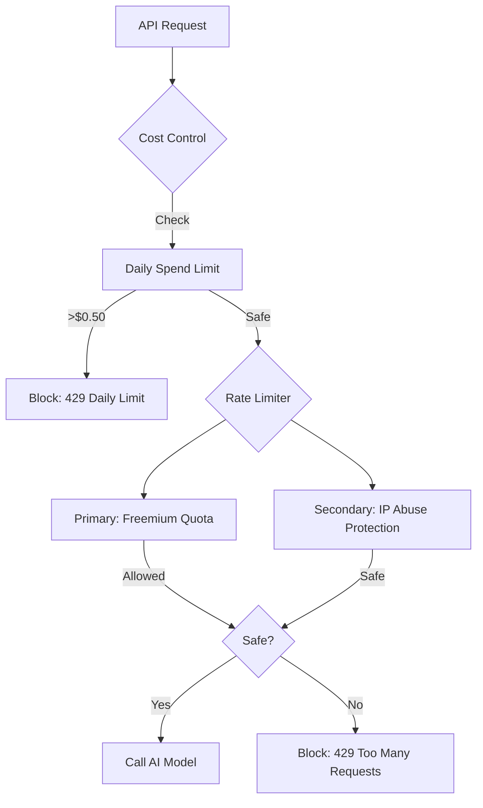

# Rate Limiting & Cost Control System

Capsera uses a multi-layered defense strategy to ensure fair usage, prevent abuse, and strictly control API costs.

## Architecture

The system is orchestrated by `ConsolidatedRateLimiter` and a dedicated `SpendTracker`.



## 1. Zero-Tolerance Layer: Cost Control
**Goal**: Prevent infinite billing loops or credit burn.

-   **Daily Spend Cap**: Hard limit of **$0.50 per user per day**.
-   **Mechanism**: Tracks actual cost of every AI call in MongoDB `daily_spend` collection.
-   **Behavior**: If a user hits this limit, they are blocked immediately, regardless of their remaining "Free/Pro" request quota.

## 2. Primary Strategy: Freemium Limits
**File**: `src/lib/freemium-rate-limiter.ts`

Handles business rules for user quotas (generations per day).
-   **Anonymous**: 2 generations per day.
-   **Free (Registered)**: 4 generations per day.
-   **Pro Tier**: Higher limits (Coming Soon).
-   **Admin**: Unlimited (`isAdmin: true` bypass).
-   **Storage**: `freemium_usage` collection in MongoDB.

## 3. Secondary Strategy: Smart Security
**File**: `src/lib/smart-rate-limiter.ts`

Handles abuse prevention independent of user quotas.
-   **IP-Based**: Tracks requests per IP address.
-   **Spike Protection**: Blocks rapid-fire requests (e.g., bot attacks).
-   **Fail-Closed**: If this system fails, it blocks requests to ensure security.

## Admin Controls

Admins can manage rate limits via the dashboard.

-   **Reset User**: Clears entries in `freemium_usage`.
-   **Reset IP**: Clears blocklist entries for an IP.

## Usage in Code

```typescript
// 1. Cost Check
const canSpend = await checkUserSpendLimit(session.user.id);
if (!canSpend) return NextResponse.json({ error: "Daily limit reached" }, { status: 429 });

// 2. Rate Limit Check
const rateLimit = await consolidatedRateLimiter.checkRateLimit(session?.user?.id, clientIP);
if (!rateLimit.allowed) return NextResponse.json({ error: rateLimit.reason }, { status: 429 });

// 3. Track Spend (After success)
await trackUserSpend(session.user.id, finalCost);
```
