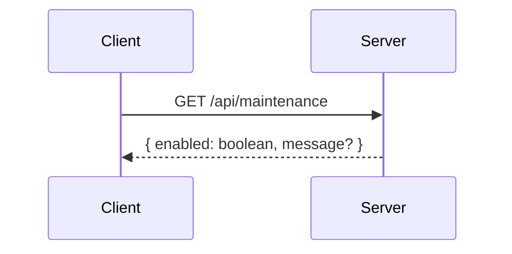
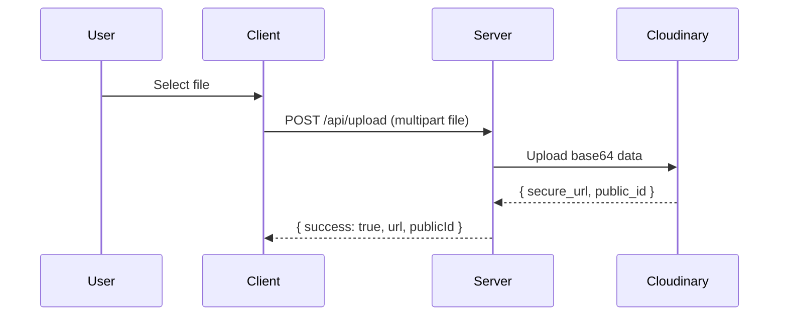
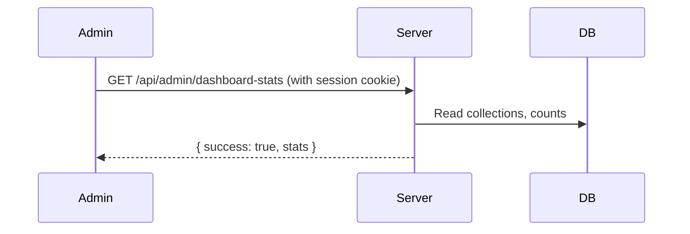

# Testing Capsera APIs Locally with Postman

This guide shows step-by-step how to test the important server APIs for Capsera locally using Postman. It covers request setup, expected responses, Postman Tests (scripts), and diagrams to illustrate flows. Where an animation would help, I explain what to record and where to store it (eg. `docs/assets/`).

## Prerequisites
- A working local dev environment with the app running at `http://localhost:3000` (run `npm run dev`).
- Environment variables set (Cloudinary keys, DB connection, etc.) when required by the API.
- Postman installed (or use Postman web). Prefer Postman v10+.
- A small test image available in the repo at `public/favicon-16x16.png` (used in examples).

## Quick checklist
- [ ] Start the Next dev server: `npm run dev` and confirm `http://localhost:3000` is reachable.
- [ ] Open Postman and create a new Collection named `Capsera - Local`.
- [ ] Add the requests below to the collection and paste the Test scripts provided.
- [ ] Run each request one-by-one and verify the response JSON and Postman Tests pass.

---

## Collection structure (recommended)
- Capsera - Local (Collection)
  - 1 - Health / Root (GET /)
  - 2 - Maintenance: Check (GET /api/maintenance)
  - 3 - Maintenance: Toggle (POST /api/maintenance)
  - 4 - Upload Image (POST /api/upload)
  - 5 - Rate Limit Info (GET /api/rate-limit-info)
  - 6 - Admin Dashboard Stats (GET /api/admin/dashboard-stats)
  - 7 - Generate Captions (POST /api/generate-captions)
  - 8 - Delete Image (DELETE /api/delete-image)

Each request below explains the configuration, examples, and Postman Tests to assert expected responses.

---

## Global Postman settings
- In the Collection, set a variable `baseUrl` with value `http://localhost:3000`.
- Optionally add an `authToken` variable for endpoints requiring authentication (you can copy NextAuth cookies or a bearer token if available).

Use `{{baseUrl}}/api/upload` in request URLs.

---

## 1 - Health / Root
- Method: GET
- URL: `{{baseUrl}}/`

Purpose: Quick smoke test to confirm the dev server responds.

Postman Tests (paste into Tests tab):
```javascript
pm.test("Server reachable", () => pm.response.to.have.status(200));
```

---

## 2 - Maintenance: Check
- Method: GET
- URL: `{{baseUrl}}/api/maintenance`

Purpose: Check whether maintenance mode is enabled.

Postman Tests:
```javascript
pm.test("Returns JSON", () => pm.response.to.be.json);
pm.test("Has enabled flag", () => {
  const j = pm.response.json();
  pm.expect(j).to.have.property('enabled');
});
```

Diagram (sequence):



---

## 3 - Maintenance: Toggle
- Method: POST
- URL: `{{baseUrl}}/api/maintenance`
- Body: raw JSON

Example body to disable maintenance:
```json
{ "enabled": false, "secret": "<your-emergency-token-if-configured>" }
```

Postman Tests:
```javascript
pm.test("Returns JSON", () => pm.response.to.be.json);
pm.test("Success true", () => {
  const j = pm.response.json();
  pm.expect(j).to.have.property('success');
  pm.expect(j.success).to.be.oneOf([true, false]);
});
```

Recording suggestion (animation):
- Record a short GIF (3-4s) of toggling maintenance ON then OFF using the POST request and show the JSON response each time. Save under `docs/assets/maintenance-toggle.gif`.

---

## 4 - Upload Image (the endpoint that previously returned 400)
- Method: POST
- URL: `{{baseUrl}}/api/upload`
- Body: form-data (multipart)
  - Key: `file` (type: File) — attach `public/favicon-16x16.png`

Notes:
- The server accepts `file` or `image` field names and will attempt to detect blob-like values.
- If successful, server returns JSON: `{ success: true, url: string, publicId: string }`.

Postman Tests (happy path):
```javascript
pm.test("Status is 200", () => pm.response.to.have.status(200));
pm.test("Response is JSON", () => pm.response.to.be.json);
pm.test("Has success true and url", () => {
  const j = pm.response.json();
  pm.expect(j).to.have.property('success');
  pm.expect(j.success).to.eql(true);
  pm.expect(j).to.have.property('url');
});
```

Error-case Tests (400/413):
```javascript
pm.test("Error response is JSON", () => pm.response.to.be.json);
pm.test("Has message property", () => {
  const j = pm.response.json();
  pm.expect(j).to.have.property('success');
  pm.expect(j.success).to.eql(false);
  pm.expect(j).to.have.property('message');
});
```

Diagram (happy path):



Recording suggestion (animation):
- Record selecting a file in Postman form-data and pressing Send, capturing the 200 JSON response. Save as `docs/assets/upload-happy.gif`.

---

## 5 - Rate Limit Info
- Method: GET
- URL: `{{baseUrl}}/api/rate-limit-info`

Purpose: Verify the quota API returns the monthly limits and remaining count.

Postman Tests:
```javascript
pm.test('Status 200', () => pm.response.to.have.status(200));
pm.test('Has remaining/maxGenerations', () => {
  const j = pm.response.json();
  pm.expect(j).to.have.property('remaining');
  pm.expect(j).to.have.property('maxGenerations');
});
```

---

## 6 - Admin Dashboard Stats (requires admin permissions)
- Method: GET
- URL: `{{baseUrl}}/api/admin/dashboard-stats`

Notes about auth:
- This endpoint requires a user session that can manage admins. In Postman you can either:
  - Copy the browser session cookie(s) for `localhost` from DevTools and paste into the `Cookies` tab for `localhost` in Postman, or
  - If you have an API token or Bearer approach in your app, set `Authorization: Bearer <token>` header.

Postman Tests:
```javascript
pm.test('Status 200 or 401', () => pm.expect(pm.response.code).to.be.oneOf([200,401]));
if (pm.response.code === 200) {
  const j = pm.response.json();
  pm.test('Has stats property', () => pm.expect(j).to.have.property('stats'));
}
```

Diagram (sequence):



---

## 7 - Generate Captions (AI flow)
- Method: POST
- URL: `{{baseUrl}}/api/generate-captions`
- Body: raw JSON

Example body (after successful upload):
```json
{
  "mood": "😊 Happy / Cheerful",
  "description": "A golden retriever puppy playing in a field of flowers",
  "imageUrl": "https://res.cloudinary.com/.../capsera_uploads/...png",
  "publicId": "capsera_uploads/abcd1234"
}
```

Postman Tests:
```javascript
pm.test('Status is 200 or 503/429', () => pm.expect(pm.response.code).to.be.oneOf([200,503,429]));
if (pm.response.code === 200) {
  const j = pm.response.json();
  pm.test('Captions array valid', () => {
    pm.expect(j).to.have.property('captions');
    pm.expect(Array.isArray(j.captions)).to.eql(true);
  });
}
```

Notes:
- AI services may be rate-limited or not configured locally; expect 503 or 429 if the AI integration isn't set up.

---

## 8 - Delete Image
- Method: DELETE
- URL: `{{baseUrl}}/api/delete-image`
- Body: raw JSON

Example body:
```json
{
  "imageUrl": "https://res.cloudinary.com/.../capsera_uploads/...png",
  "publicId": "capsera_uploads/abcd1234"
}
```

Postman Tests:
```javascript
pm.test('Status 200 or 400', () => pm.expect(pm.response.code).to.be.oneOf([200,400]));
const j = pm.response.json();
pm.test('Has success flag', () => pm.expect(j).to.have.property('success'));
```

---

## Helpful Postman Test snippets (copy/paste)
- Generic success validator
```javascript
pm.test('Success response', () => {
  pm.response.to.be.json;
  const j = pm.response.json();
  pm.expect(j).to.have.property('success');
});
```

- Generic error validator
```javascript
pm.test('Error has message', () => {
  pm.response.to.be.json;
  const j = pm.response.json();
  pm.expect(j.success).to.eql(false);
  pm.expect(j).to.have.property('message');
});
```

---

## Diagrams and animations guidance
- Diagrams included above use Mermaid. Postman markdown viewer doesn't render Mermaid by default; place the mermaid code into a separate file or use an online mermaid renderer for prettier diagrams.
- Record short animated GIFs for these actions and save them under the repo `docs/assets/`:
  - `maintenance-toggle.gif` — toggling maintenance POST
  - `upload-happy.gif` — Upload file with `file` and show 200 JSON response
  - `upload-error-missing.gif` — Send empty form-data and show 400
  - `generate-captions.gif` — Run caption generation and show responses

How to record:
- Use a tool like ShareX or Peek/GIF-cap in Linux, or the built-in Windows Game Bar > Capture, then convert to GIF.
- Keep captures short (2–6s), crop to the Postman window, and compress with gifsicle if file size is large.

Suggested place to reference them in docs:
```markdown

```

---

## Troubleshooting & common pitfalls
- 400 "No file uploaded" even when Postman shows a file: Open Postman Console (View → Show Postman Console) and verify the request payload is multipart/form-data and includes a `Content-Disposition: form-data; name="file"; filename="..."` section.
- 413 File too large: Some proxies (or local limits) can block >10MB uploads. Confirm the dev server is configured to accept 10MB.
- Non-JSON responses: If an upstream service (Cloudinary, AI) returns non-JSON or an error with an HTML body, the API will still wrap or return JSON; if not, check server logs for raw error message.
- Auth-protected endpoints: When testing endpoints requiring a session, either copy browser cookies into Postman or use a test API token if your app supports one.

---

## Final checklist before reporting "upload bug fixed"
- [ ] Verified `/api/upload` returns 200 + JSON when Postman `file` is set.
- [ ] Verified `/api/upload` returns 200 when `image` is used (backwards compat).
- [ ] Verified client successfully parses response and no JSON.parse errors appear in browser console.
- [ ] Verified error responses are JSON for 400/413/500.

---

If you want, I can:
- Create the Postman Collection JSON and add it to `docs/assets/postman_collection.json` so you can import it directly.
- Record and add the short GIFs to `docs/assets/` and reference them in this document.

Tell me which of the two extras you want and I'll add them next.
